# 🏗️ AI旅行规划系统架构图

## 📊 整体系统架构

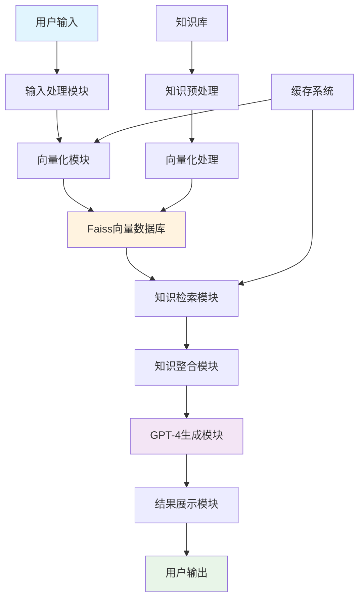

## 🔄 数据流程图

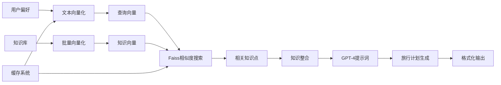

## 🧠 核心组件详解

### 1. 向量化模块 (Embedding Module)

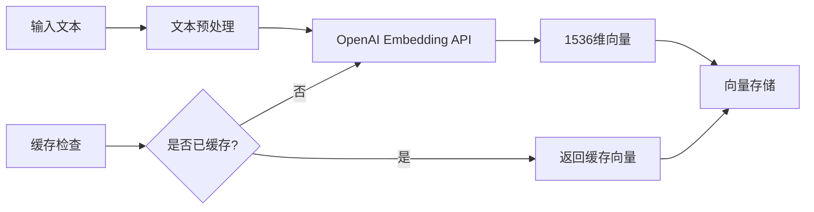

**功能说明:**
- 将自然语言文本转换为数值向量
- 使用OpenAI的text-embedding-ada-002模型
- 实现向量缓存机制提高效率

### 2. 向量数据库 (Faiss Index)

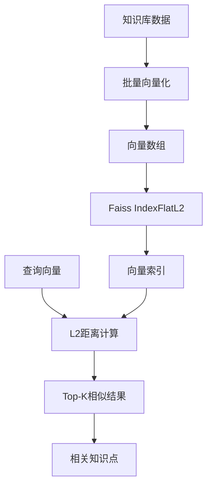

**技术特点:**
- 使用L2距离进行相似度计算
- 支持高效的K近邻搜索
- 可处理大规模向量数据

### 3. 智能代理 (Agent)

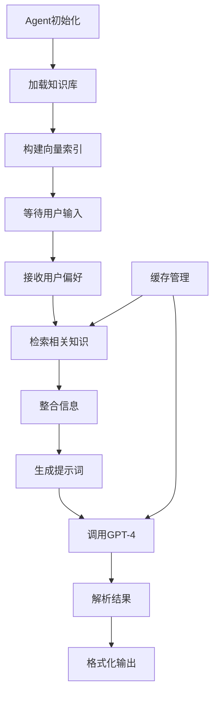

**代理功能:**
- 协调各个模块的工作
- 管理用户交互流程
- 处理数据转换和结果展示

### 4. 知识库结构

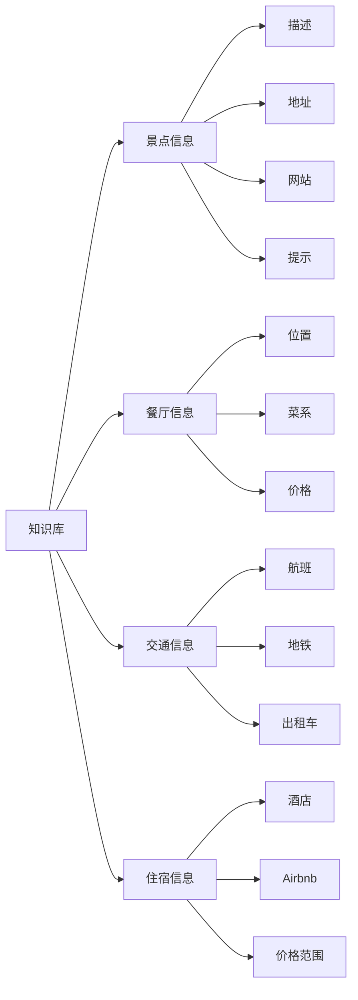

## ⚡ 性能优化架构

### 1. 缓存系统设计

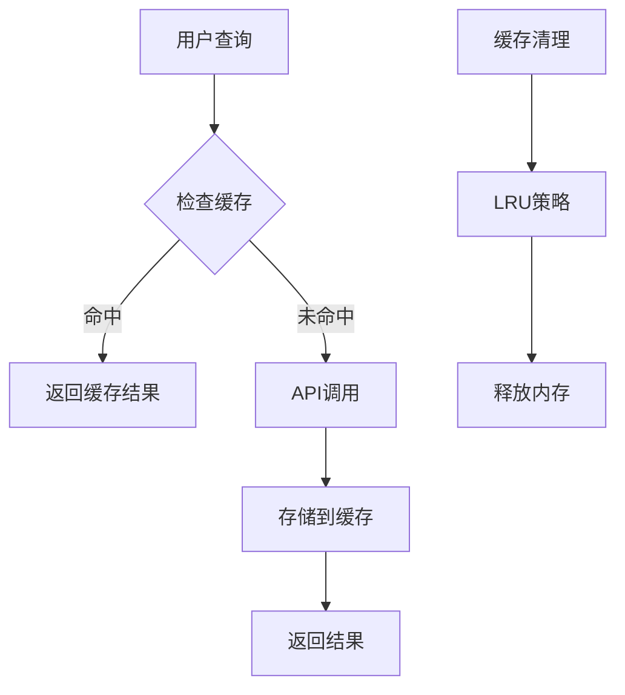

**缓存策略:**
- LRU (Least Recently Used) 缓存策略
- 嵌入向量缓存减少API调用
- 查询结果缓存提高响应速度

### 2. 并发处理架构

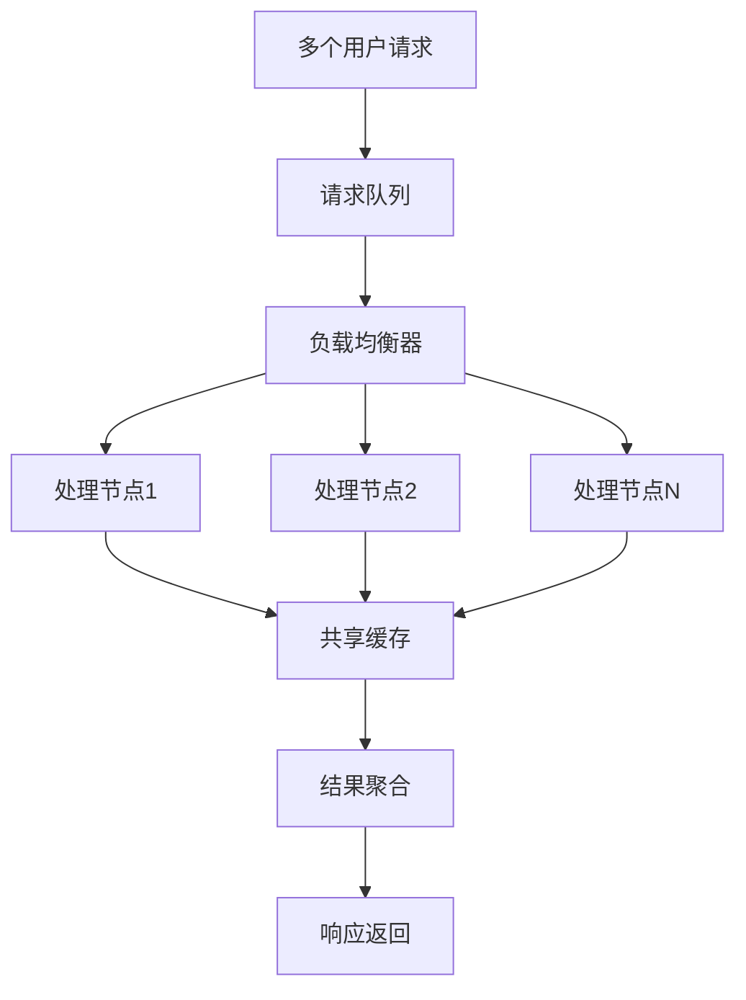

## 🔧 技术栈架构

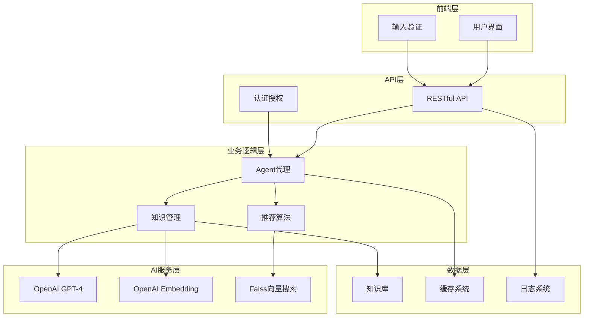

## 📈 系统性能指标

### 响应时间分析

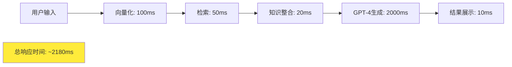

### 缓存命中率

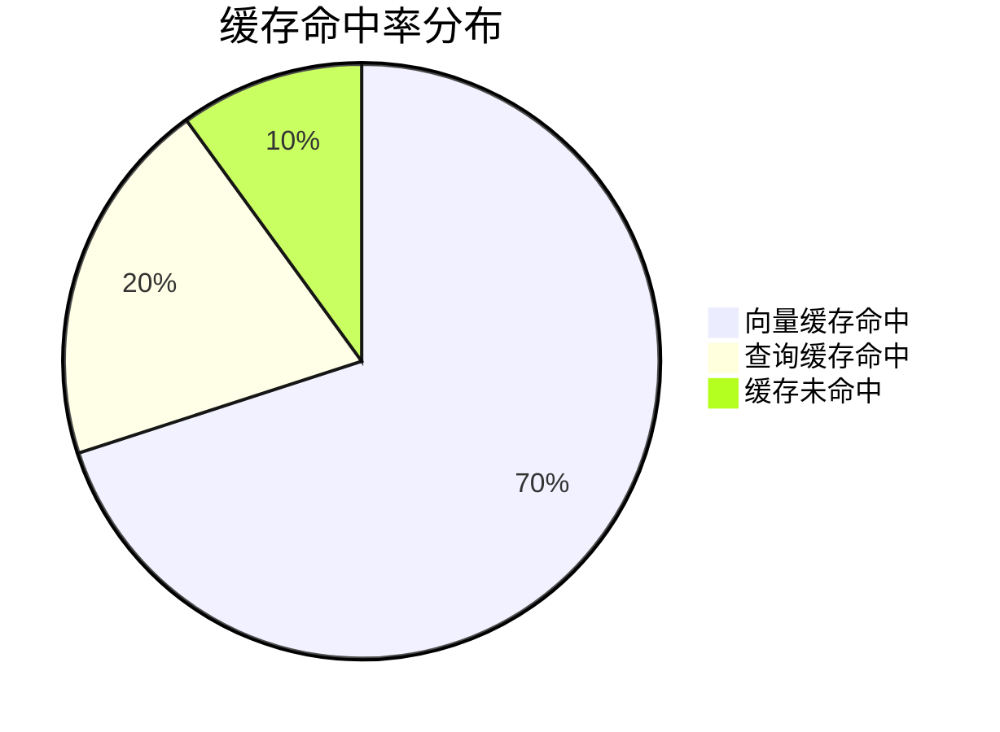

## 🔮 扩展架构设计

### 微服务架构

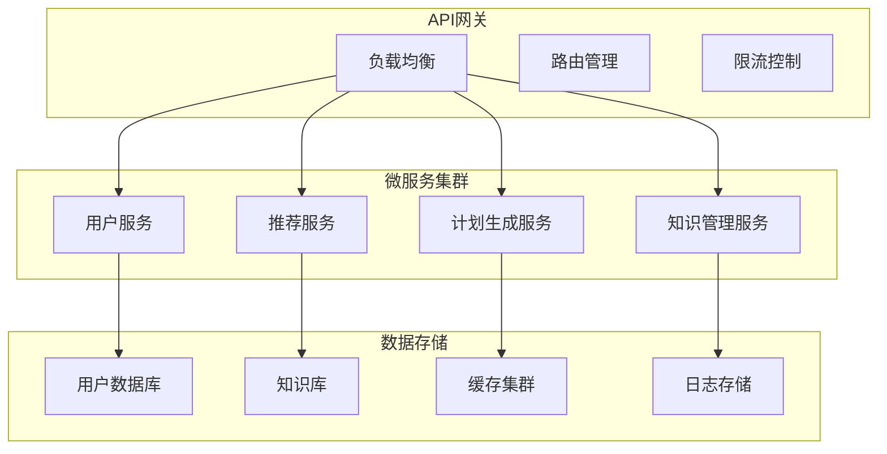

### 分布式部署

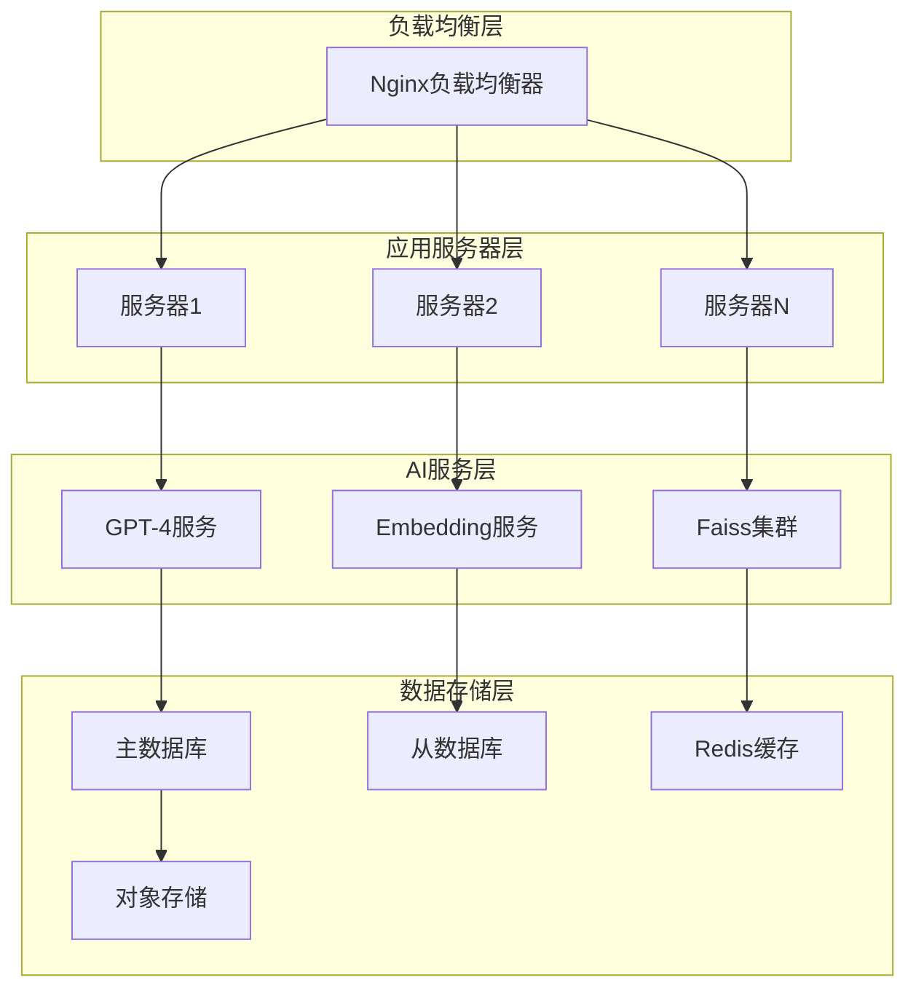

## 🛡️ 安全架构

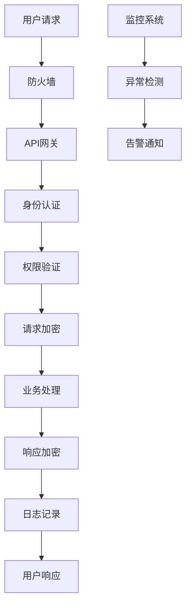

**安全特性:**
- API密钥管理
- 请求加密传输
- 访问权限控制
- 异常监控告警

---

## 📋 架构总结

这个AI旅行规划系统采用了现代化的微服务架构设计，具有以下特点：

### 🎯 核心优势
- **高可用性**: 多节点部署，故障自动切换
- **可扩展性**: 模块化设计，支持水平扩展
- **高性能**: 缓存机制，向量化优化
- **安全性**: 多层安全防护，数据加密

### 🔧 技术特色
- **AI驱动**: 结合GPT-4和向量检索技术
- **智能推荐**: 基于语义相似度的个性化推荐
- **实时响应**: 缓存和并发处理优化
- **用户友好**: 直观的交互界面和详细的结果展示

### 🚀 未来扩展
- **多模态支持**: 整合图像、音频信息
- **实时数据**: 接入交通、天气等实时信息
- **社交功能**: 用户评价和推荐系统
- **预订集成**: 直接预订服务集成 